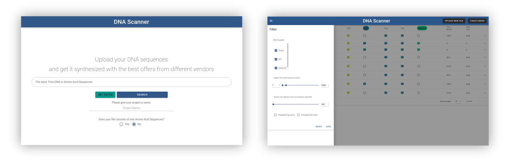

# DNA-scanner

DNA Scanner is a web application to quickly find and compare vendors for synthetic DNA ordering. Users provide sequences in FASTA, Genbank, or SBOL format, and obtain, for each sequence, a comparison of the lead time and pricing of all vendors capable of producing the sequence.



The project is an initiative of the [Global Biofoundry Alliance](https://biofoundries.org/) to streamline the ordering or DNA in large-scale genetic engineering projects.

If you find this work useful, please consider citing the corresponding publication:

DNA Scanner: a web application for comparing DNA synthesis feasibility, price and turnaround time across vendors

Gledon Doçi, Lukas Fuchs, Yash Kharbanda, Paul Schickling, Valentin Zulkower, Nathan Hillson, Ernst Oberortner, Neil Swainston, Johannes Kabisch

Synthetic Biology, Volume 5, Issue 1, 2020, ysaa011

https://doi.org/10.1093/synbio/ysaa011

# Installation

## Prerequisites

- The application runs in a docker container, therefore docker and docker-compose must be installed.
- Clone the project from the git repository.
- Add your credentials for the different vendor APIs in the `Backend/config.yml` configuration file.

## Development installation

In the development environment, a database is made available within a container. This is not the case in the production environment, because it is not recommended for production use.

Use the shell script _deploy.sh_ to start the environment. The script will run docker-compose with the _docker-compose.yml_ and it will be extended by the _docker-compose.override.yml_.

```
chmod 775 deploy.sh
sudo ./deploy.sh
```

By default the _./Backend/config.yml_ has the database credentials as configured in the _docker-compose.override.yml_.

By default the volumes of the database are bound to _/srv/dnascanner/db/_ to make the data persistent. You can make the saved information temporary by removing the volume shown below from the _docker-compose.override.yml_.

`- /srv/dnascanner/db:/var/lib/mysql`

### Force Rebuild

You can force a rebuild without caching using the script _rebuild.sh_.

```
chmod 775 rebuild.sh
sudo ./rebuild.sh
```

## Production installation

The production environment requires a separate database. You can configure it in _./Backend/config.yml_. In the production environment the database must be separate because it is not recommend to run a database inside of a container for production use.

Certificates for https are required for the production environment. The certificates must be placed in `/srv/dnascanner/cert/`. In the following code we create the directory and generate self-signed certificates. Alternatively you can put your own certificates there. The certificates are configured in the file _nginx-secure.conf_.

```
mkdir /srv/dnascanner/cert -p
sudo openssl req -x509 -nodes -days 365 -newkey rsa:2048 -keyout /srv/dnascanner/cert/cert.key -out /srv/dnascanner/cert/cert.crt
```

The _nginx-secure.conf_ will be used as default. You can also place an specific nginx configuration file in `/srv/dnascanner/nginx/`.

Use the shell script _deploy-prod.sh_ to start the environment. The script will run docker-compose with the _docker-compose.yml_ and it will be extended by the _docker-compose.prod.yml_.

```
chmod 775 deploy-prod.sh
sudo ./deploy-prod.sh
```

# Configuration

Name           | Description
-------------- | ----------------------------------------------------------------------------------------------------------------------------------------------------------------------------------
Port           | The default port is 80\. You can change it in the docker-compose.prod.yml. At services > frontend > ports. Just write your port before the ":443".
Mapped folders | The default the folders are mapped into /srv/dnascanner/. You can change it in the docker-compose.prod.yml. At services > frontend > volumes. Just write your path before the ":".

# Common Errors

Failure                                                                                                                                       | Description                                                             | Solution
--------------------------------------------------------------------------------------------------------------------------------------------- | ----------------------------------------------------------------------- | ------------------------
Failure running the Deploy-Script: "Got permission denied while trying to connect to the Docker daemon socket at unix:///var/run/docker.sock" | The user on the system does not have the rights to start the containers | Run the Script with sudo
